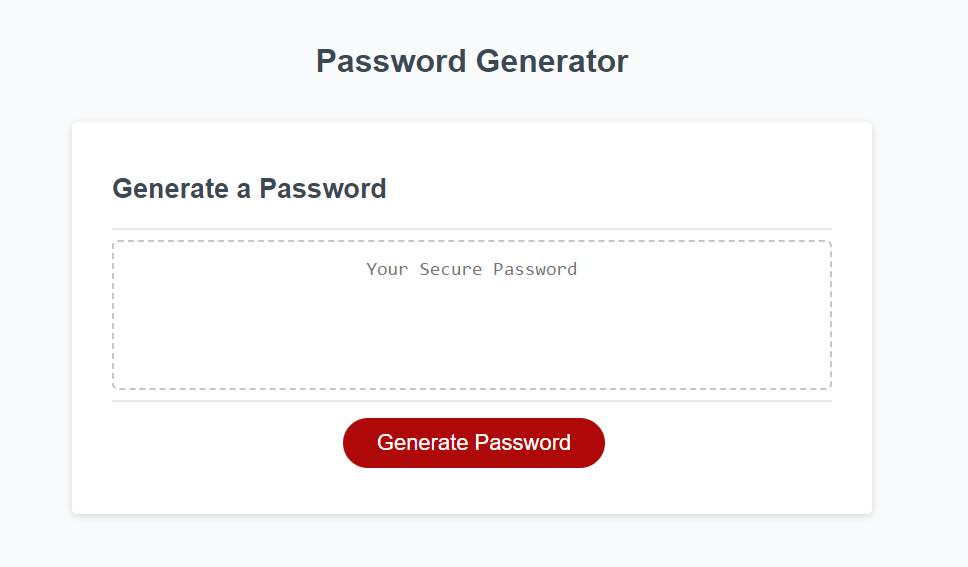

# <JavaScript Password Generator>

## Description

This application is a basic password generator, built mostly on JavaScript and giving the user the option of length and types of characters to be included in their generated password. The live application can be found [here](https://lxpap.github.io/JS_Generator_AP/)

## Installation

No installation is necessary for this application.

## Usage

In order to use this application, start by clicking on the "Generate Password" button. You will be asked about your desired length (it can be between 8 and 128 characters), as well as character sets that you would like the generator to use (these are lower case letters, upper case letters, numbers and special characters). It is recommended to use all 4 character types and a length of over 12 for your security. 

   

   

## Credits

Information and research to aid development was done using the following resources:

[StackOverflow](https://stackoverflow.com/)
[MDN](https://developer.mozilla.org/en-US/)
[Google Bard](https://bard.google.com/)

## License

A copy of the MIT License can be found in this repository.

